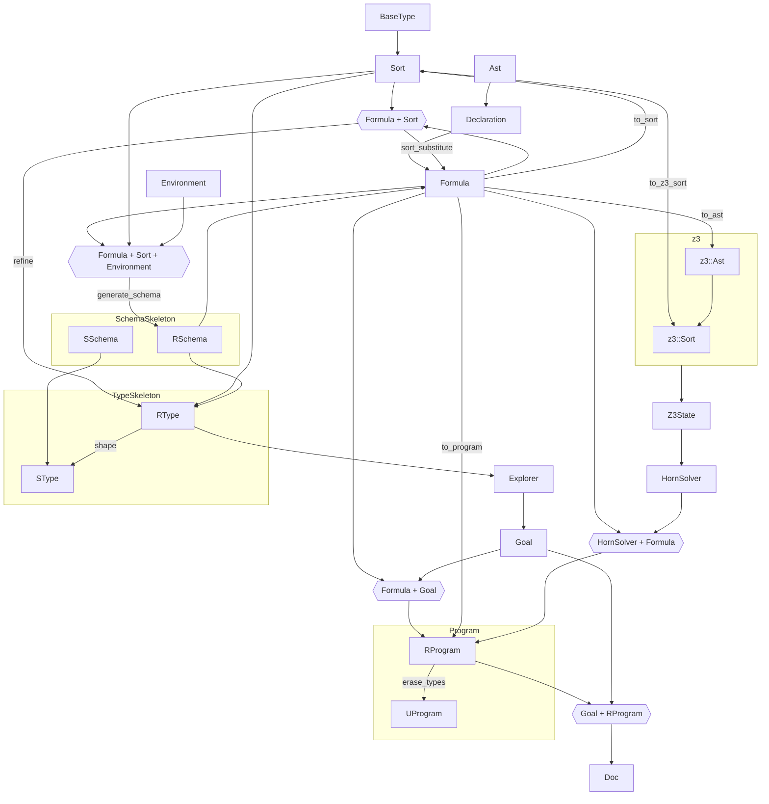

- Get mininal example running
- `measure`s are not type-checked?
- Synqiuid synthesis goes into quickcheck generator

- `Formula` to `Sort`
  - Always loses information of name and value, only keeps type information.
  - Converts `Formula::Unknown`, `Formula::All(..)`, and all `Formula::BinOp` boolean operations to `Sort::Bool`.
  - Converts `Formula::BinOp(..)` arithmetic operations to `Sort::Int`.
  - Converts `Formula::Ite(..)` to only the `Sort` of the true branch.
    - Assumes both branches have the same `Sort`.
- `BaseType` to `Sort`
  - Converts `BaseType::Int` to `Sort::Int`.
  - Converts `BaseType::Bool` to `Sort::Bool`.
  - Loses representation of `Sort::Var(..)`, `Sort::Set(..)`, and `Sort::Any`.
  - Contains additional `Id` information over `Sort` for `BaseType::TypeVar(..)`.
